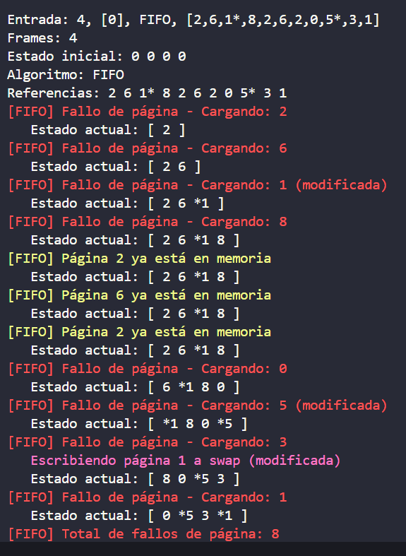
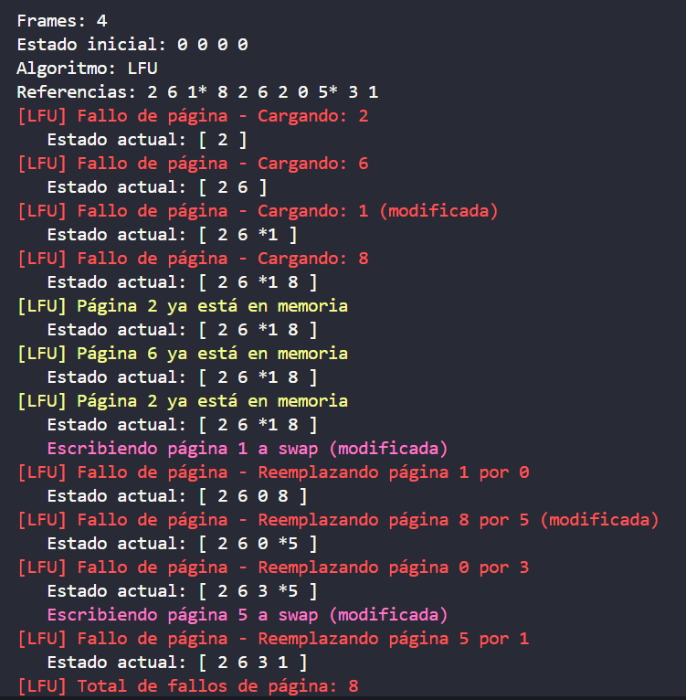
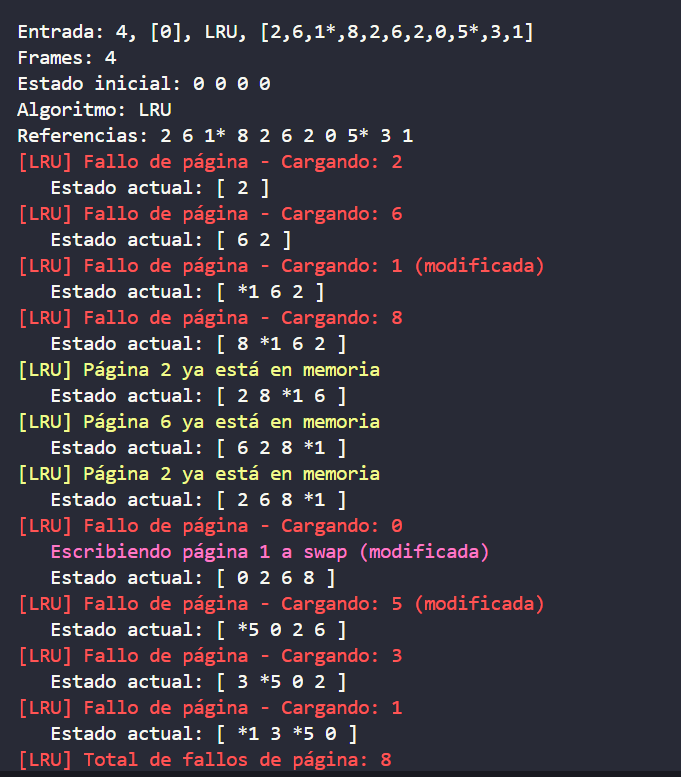
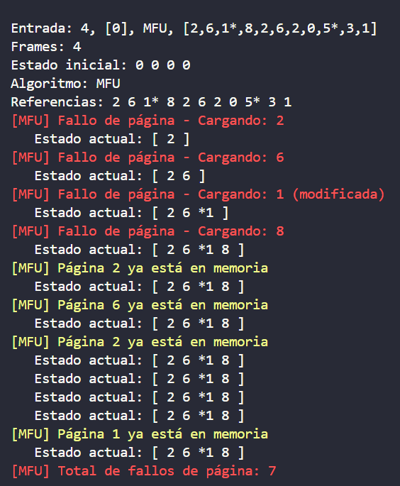
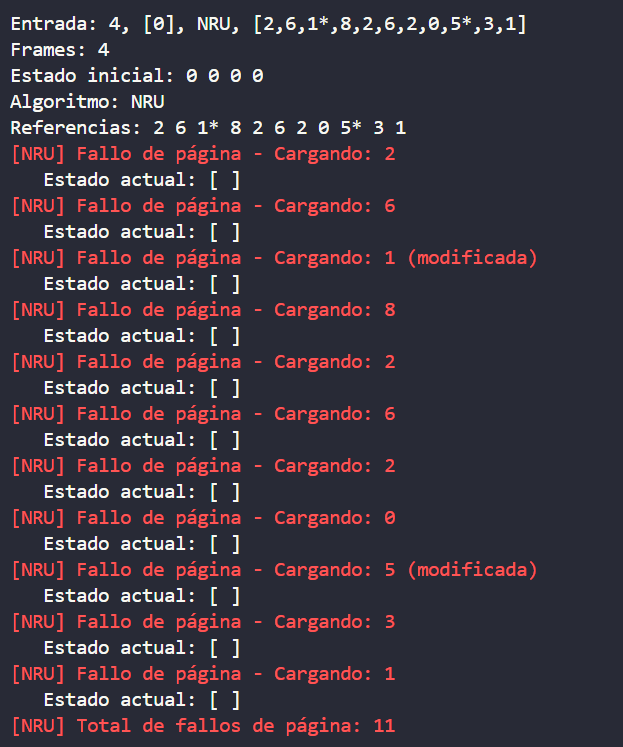
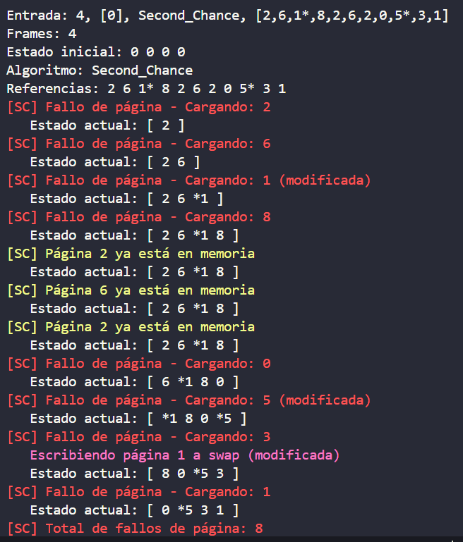
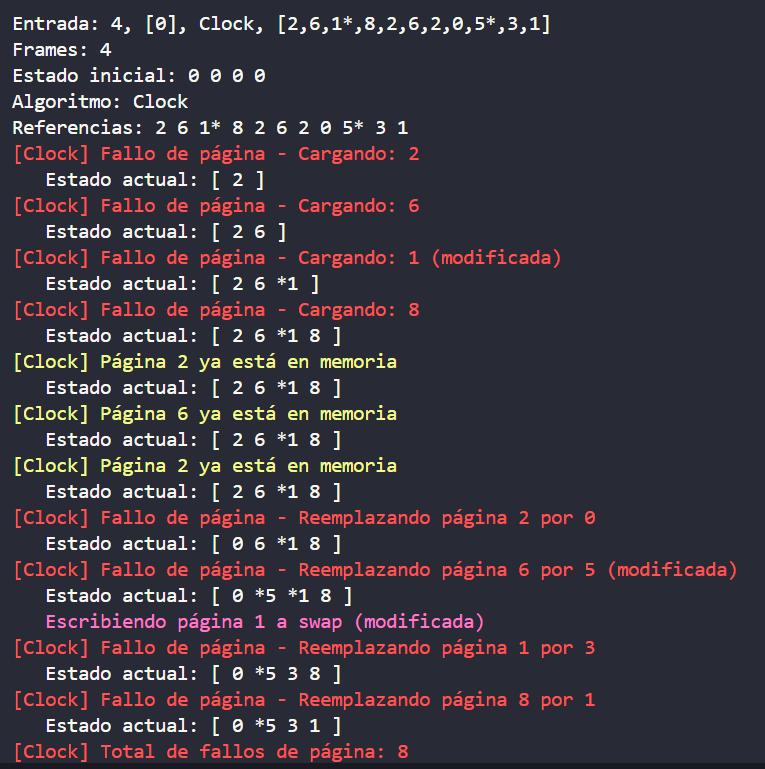
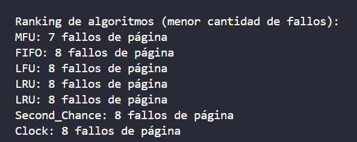

# Simulación de algoritmos de paginación

## Descripción

Para esta tarea teniamos que implementar en C++ la simulación de distintos **algoritmos de paginación**, y así compararlos en las mismas condiciones. El programa lee un archivo de pruebas, procesa cada entrada y muestra el resultado de simular cada algoritmo, también incluyendo un ranking de eficiencia basado en quien tuvo menos cantidad de **page faults**  

## Algoritmos que debiamos implemetar  

- **FIFO** (First-In, First-Out)  
- **LRU** (Least Recently Used)  
- **LFU** (Least Frequently Used)  
- **MFU** (Most Frequently Used)  
- **Second Chance**  
- **NRU** (Not Recently Used)  
- **Clock**  


## Compilación y ejecución  

Desde la carpeta TP2

```sh
make
./bin/Sistemas prueba_2.txt
```
**Puede probar con los distintos archivos de prueba**

## Créditos

**Fabricio Agüero Mata-C20097**  
**Sebastián Hernández Porras-C23770**

# Anexo de Imagenes de Resultados

  
  
  
  
  
  
  
  
  
  
  
  
  
  
  
