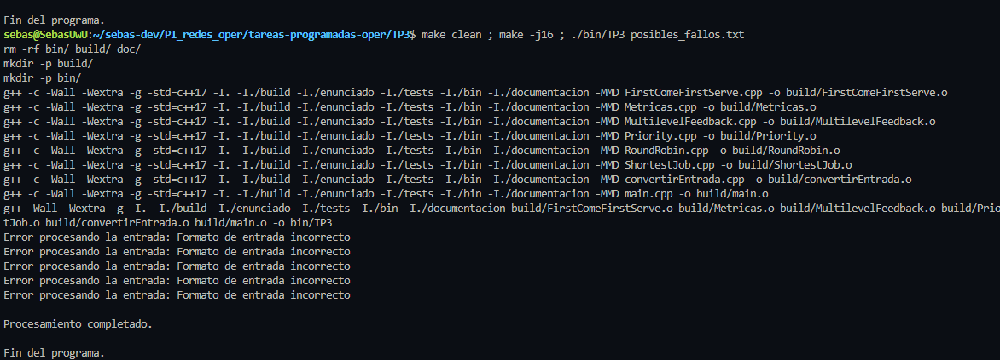
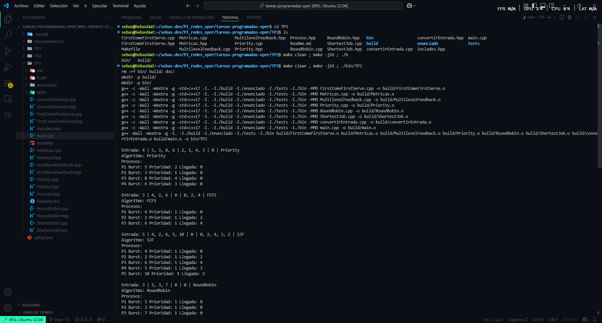
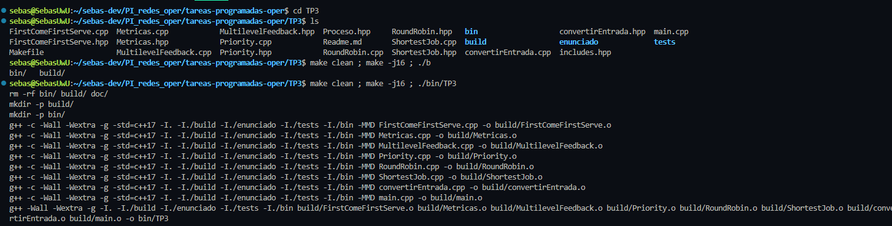
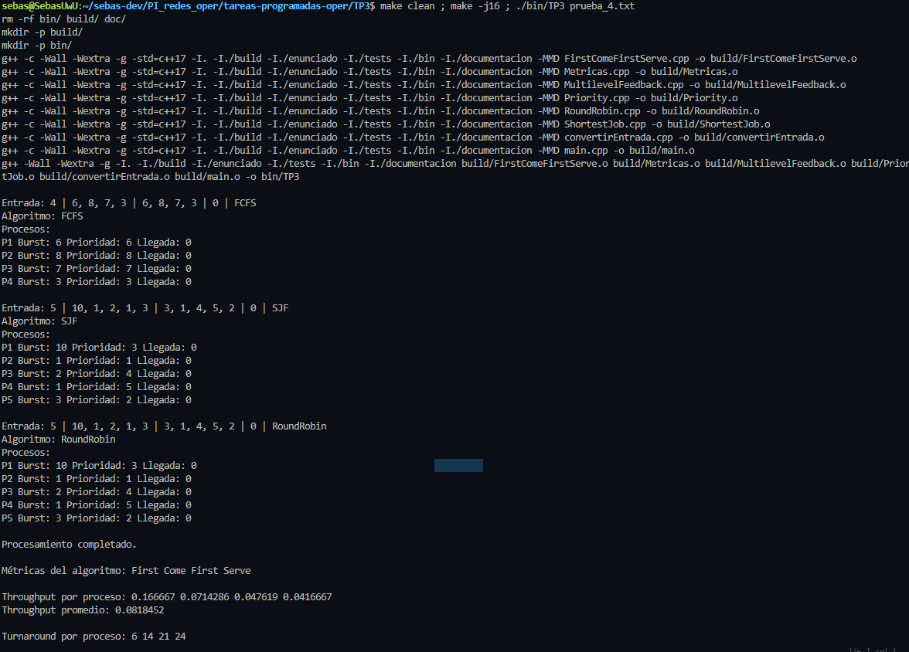
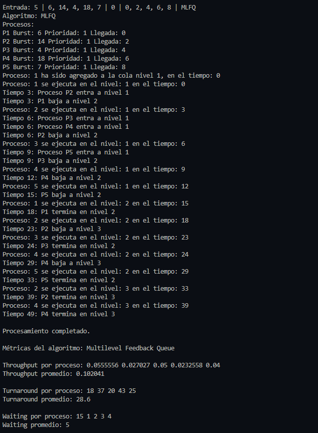

# Simulación de algoritmos de planificación de procesos

## Descripción

Para esta tarea implementamos en C++ la simulación de distintos **algoritmos de planificación de procesos**, vistos en el capítulo 5 del libro de texto. El objetivo fue comparar estos algoritmos bajo las mismas condiciones de entrada, evaluando su desempeño con base en métricas clave como **Throughput**, **Turnaround time** y **Waiting time**.  

El programa recibe por parámetro la información de varios procesos (al menos dos), incluyendo:

- Tiempo de llegada (si aplica)
- Tiempo de ráfaga o "burst time"
- Prioridad (si aplica)
- Algoritmo a analizar

Una vez ingresados estos datos, el programa simula la planificación de los procesos aplicando el algoritmo correspondiente, y genera estadísticas sobre su rendimiento.

## Algoritmos que debíamos implementar

- **First Come First Served (FCFS)**
- **Shortest Job First (SJF)**
- **Round Robin (Quantum = 2)**
- **Priority Scheduling**

## Compilación y ejecución

Desde la carpeta TP3:

```sh
make
./bin/TP3 prueba_3.txt
Puede probar con distintos archivos de prueba
```

# Puntos extra Multilevel Feedback Queue  

Este algoritmo fué implementado usando 3 colas que simulan tres niveles de prioridad.  

En el nivel 1 utilizamos **Round Robin** con un quantum de 3, esto para respuesta rápida en procesos cortos.  

En el nivel 2 también utilizamos **Round Robin** pero con un quantum de 5, esta vez para procesos un poco más largos. 

Por último, en el nivel 3 usamos First Come First Serve, que es la última cola de prioridad, para los procesos que no se ejecutaron en los niveles superiores.  

**Ingreso:** Todos los procesos llegan al nivel 1, si se le acaba el quantum se pasa al nivel inferior, y asi sucecesivamente con el nivel 2, pasanso hasta el nivel 3.  

En la implementación agregamos prints para ver la llegada de procesos, como estos se ejecutan, y como son trasladados a otro nivel.  

**Créditos**  
**Fabricio Agüero Mata - C20097**  
**Sebastián Hernández Porras - C23770**  

# Anexo de Imágenes Adicionales

## Fallos de ejecución

## Ejecución General

## Compilación funconal

## Uso de tests espeficicos

## MLFQ



